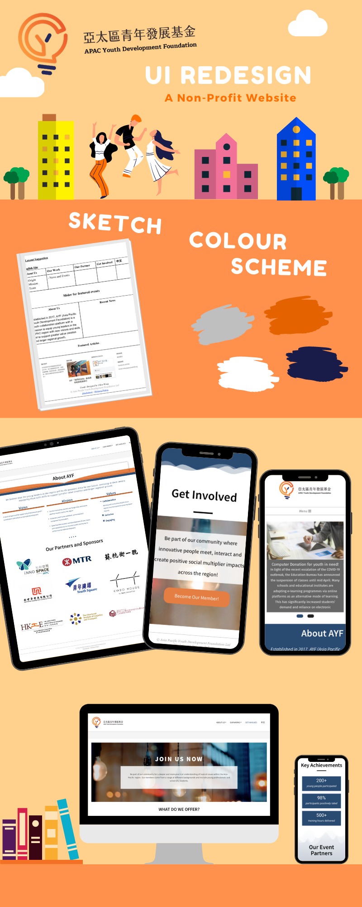

## Redesigning a WordPress Site

**Organisation**: Asia Pacific Youth Development Foundation

**Timeline**: 1 month

**Setting**: WordPress environment with CMS system.

**Layout guideline**: Compelling, Modern and Clear.

**My responsibility**: Static design, Responsive design and Call-to-action input.

**Objectives**:
1.	To migrate the existing website for a clearer branding.
2.	Showing professional brand image so as to build up creditability.
3.	Engaging more potential partners/ members from the website.

