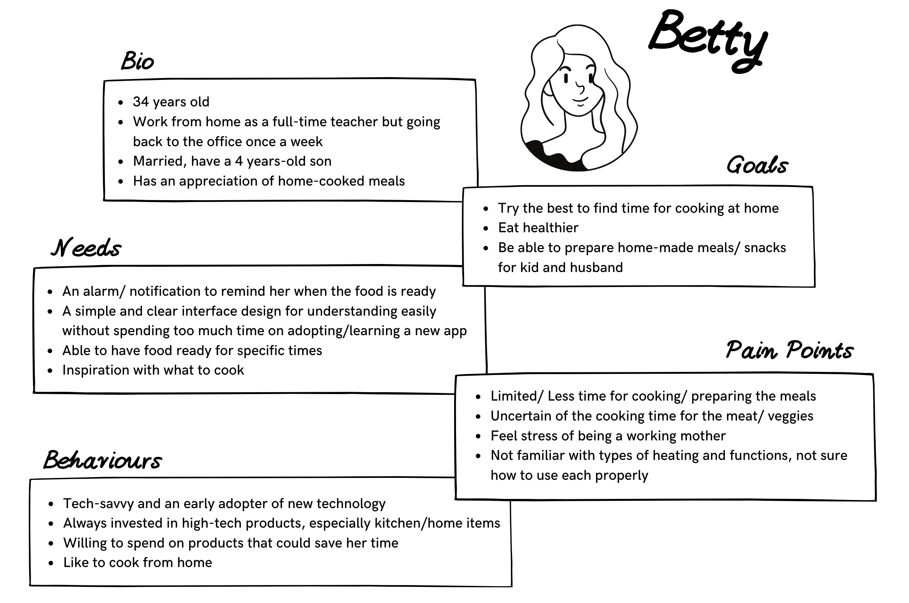

# Design Task - Open Oven

Task: Design a mobile app for Open Oven's Buttonless Oven

Time: 3 days

Setting: iOS

Tools: Pen, Paper, Canva, Adobe XD

*****
## Situation
Design a mobile application for a new startup called Open Oven that will allow customers to fully operate their Buttonless Oven. Following the brand's mission statement "To combine tradition with technology and bring developments in the world of hardware and software to the heart of everyone's home - the kitchen".

 
## What's a smart oven?
A smart oven connects to the user's home Wi-Fi or use Bluetooth to allow the user to control it from elsewhere in the house or outside with their digital devices.

 
## Market Research
Starting with a quick market research to identify the concept of the product and competitors. Also, analysing the pros and cons by reviewing user feedback.

After understanding more about existing Smart Ovens and exploring potential features for the app. Let's move on to the user research to understand the characteristics of the potential users, what they need and their behaviour.

 
## The Segmentation of the Target Market

 
## User behaviour: Cooking process with the traditional oven
Understanding how the user behaves when using their oven helped to define the core features of the app. This step is crucial to the design process as it shapes the direction the product will take. This is the moment to brainstorm and to make a story board on a face-to-face meeting.

 
## Persona - Meet Betty

## So, what is Betty doing?
I created these two scenarios for Betty to simulate an actual person using the app. It will help me to understand more about the internal or external factors, such as the user’s motivations and mindset. These insights will be the inspiration for designing the user flow, the layout and the user interface for the app in a later stage.

 
#### Scenario 1: Working from home
Betty’s working at home → Starts baking her lunch → Pick up her son from the nursery → Lunch is ready when the kid gets home → Continue working while kid takes a nap → Preparing the ingredients and put them in the oven → Dinner is ready when the husband gets home

 
#### Scenario 2: Working in the office
Working in the office → Meal has been prepped already → Pick up her son from the nursery → Use the app to start cooking the prepared meal in the oven → Food is ready when they get home

 

# Design Thinking Model
 
### Empathise
* Technical and design issues, includes the app being unresponsive, crashing, bugs, unclear and messy UI design (colour, layout & navigation) according to the competitors’ users reviews.
* Safety issues, with kids /pet at home
* Connection issues - unstable connectivity.
* Limited time for cooking and learning new technology
* Not familiar with the use of all heating options
* Cleaning the oven is probably the last thing you want to do because it is cumbersome, requiring hard chemicals to remove the grease from the most hidden corners of the oven.

 
### Define
Using a Smart Oven like Open Oven shouldn't be more complicated than a traditional oven. People want a reliable and stable connection to their oven, clear UI design and on-boarding experience. Furthermore, the customer wants to be reassured of their safety and that of their children.

 
### Ideate
What are the primary features that the app needs?
* Timer
* Temperature
* Heating options
* Pre-heat
* Cooking notifications

 Any additional features that could be nice to have? 
* Smart lock
* Self-cleaning
* Pre-set: recipes
* Digital message box
To add recipes as a feature the app needs to have multiple screens.

 
### Prototype
#### User flow of the registration and oven set-up
Having a simple and clear set-up and on-boarding is very important. A user flow to illustrate the steps necessary to follow can be used to map out every step.

 
#### Sitemap
Organising the data and components in the app is achieved by thinking of the structure as a sitemap. A sitemap is different from a user flow because it is immutable, and it shows where in the app each feature is located.

 
#### Sketches (Paper & Pen)

 
#### Wireframes (Adobe XD)

## So, how does the cooking work?

 
## And how to cook with a recipe?

## Branding
Logo Design, Colour palette and Fronts

#### Thank you :)
