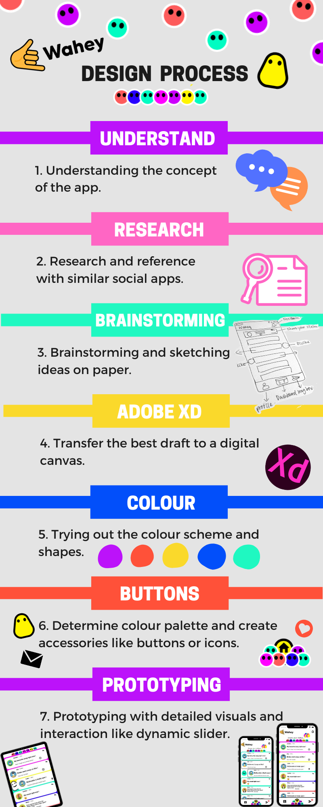
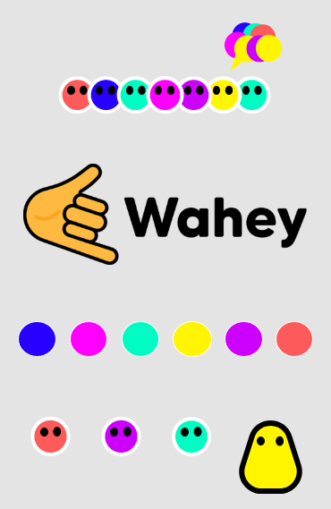
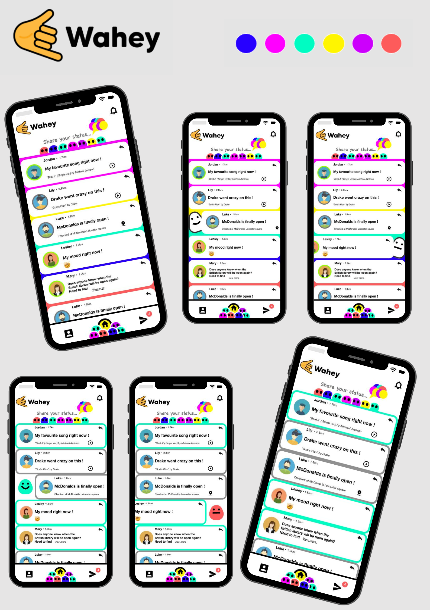

# Designing a Brand New Social Mobile App

Brand: Wahey

Time: 2 days

Setting: IOS

Layout guideline: Bold, unique and fun

Materials: Paper & Pen, Adobe XD

Techniques: Business Analysis, Sketching, Wireframing & Prototyping

Background: Wahey is a new social discovery platform. An app for making new friends and discovering the world around you.

## Idea of the elements design:
The idea behind these is that the users are individuals that could be from different backgrounds, colour or gender, but together they form a community.

The presentation:

