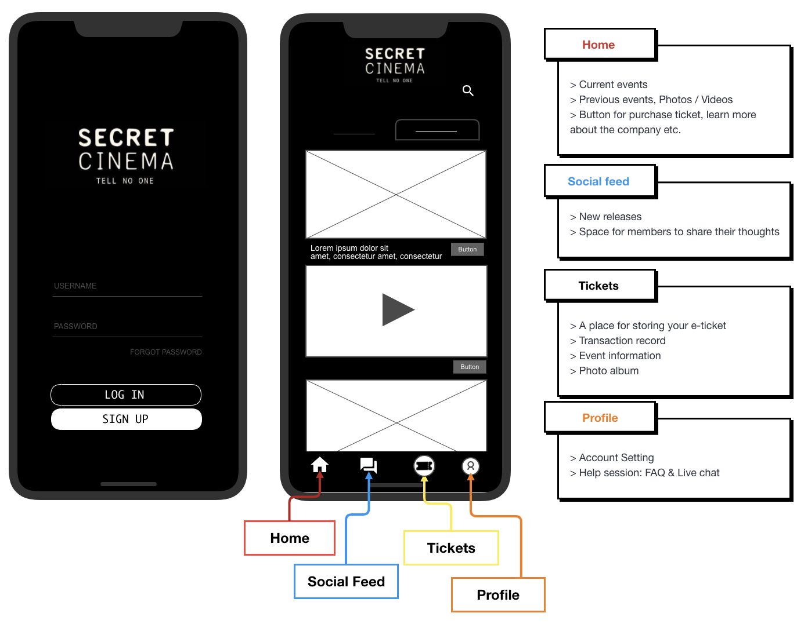
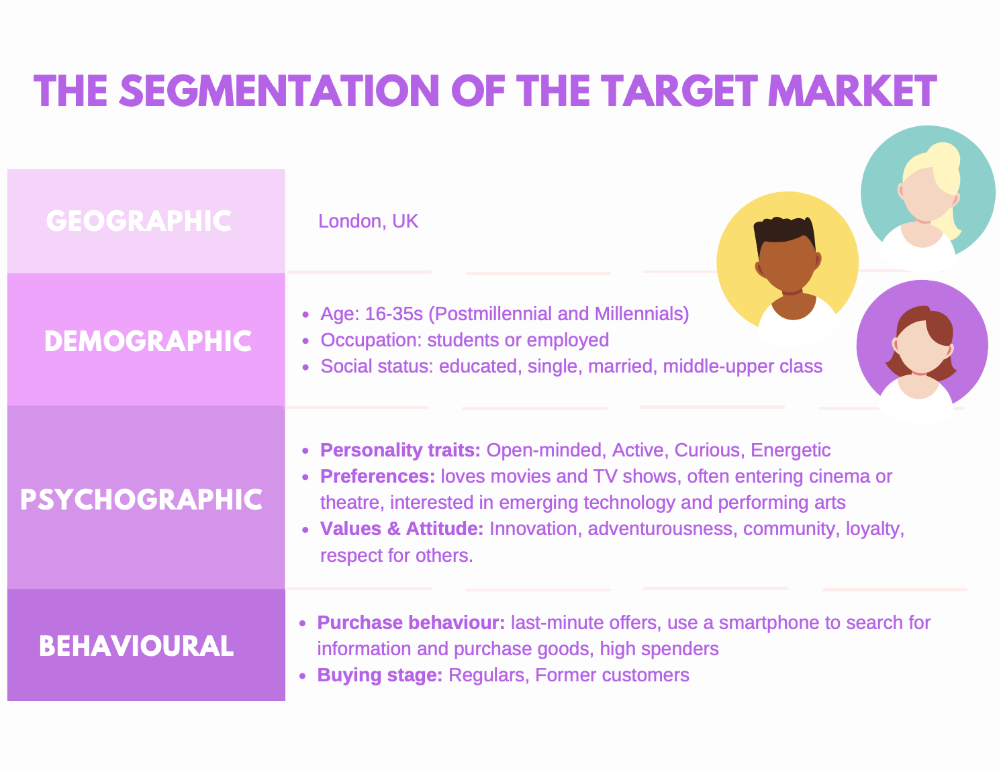
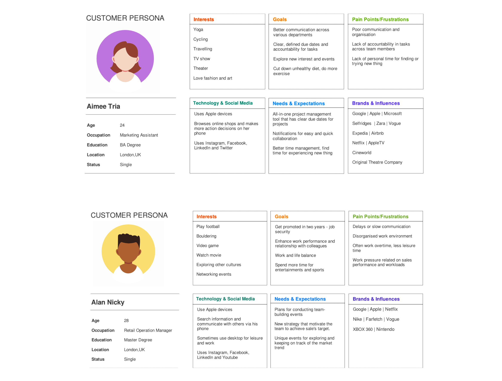
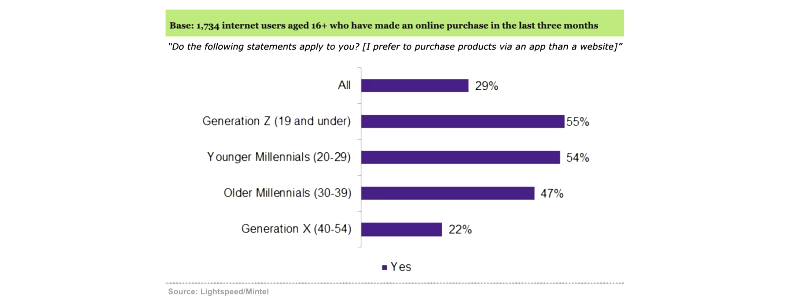
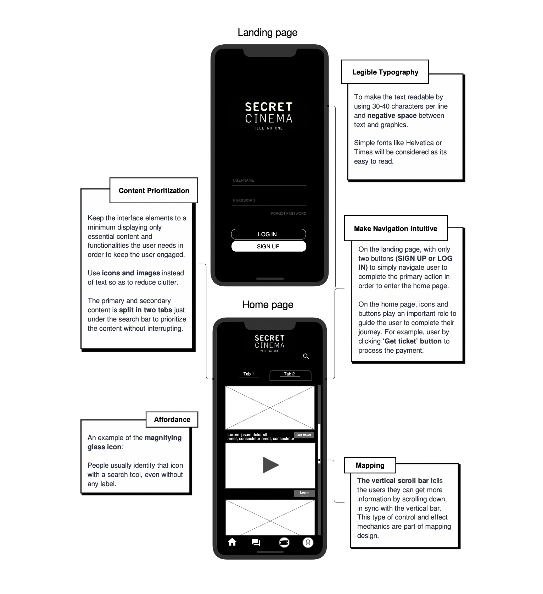
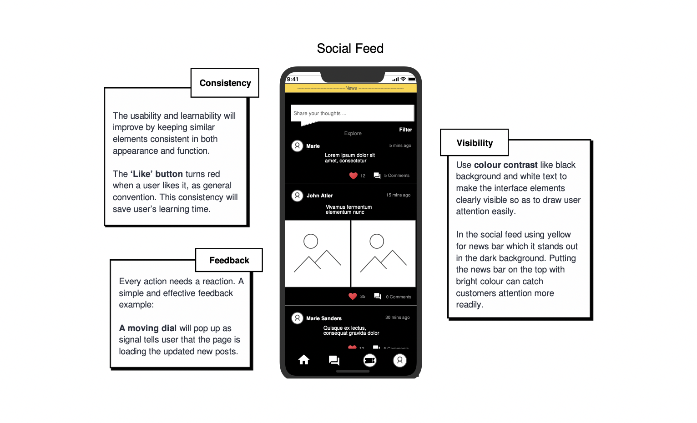

# A UX Case Study
Creating a new mobile application for an existing UK brand called Secret Cinema

*******
Time: 1 month

Setting: IOS & Android

Materials: Adobe XD, Canva, draw.io iMovie



###  INTRODUCTION
Secret Cinema is an entertainment company that specialises in immersive film and television events at unusual locations like pubs, prisons, car parks and more. Founded and created by Fabien Riggall in 2007. The screenings used to be secret venues in London as well as interactive performances in purpose-built sets. Nowadays, they host a 360° participatory Secret World where thousands of audiences interact with their favourite characters inside of the unique spaces to become part of the story.

 
### THE NEW SERVICE: ‘TELL NO ONE ‘MOBILE APPLICATION
‘TELL NO ONE’ is a mobile application that includes basic features like ticket management system, customer service, product information, updates and so on. Adding personal features, like social feed and secret photo album to enhance customer engagement and experience.

 
### THE INNOVATION PROCESS
In order to develop the innovative product or service, the design thinking model proposed by [d.school](https://dschool.stanford.edu/) will briefly explain the design process below:

### CUSTOMER INSIGHTS AND TRENDS
Recently, Secret Cinema signed a deal with Walt Disney Studio and Netflix that could extend their global market share. The majority group aged 16-24 and mostly from London thought the immersive experience is appealing which is also confirmed by Mintel. Since immersive theatre is a new genre that appeared over recent years, it attracts new generations to the performing arts.  

Approximately 99% of internet users own a smartphone across all age groups, thus smartphones have become a necessity. Around half of the users prefer using smartphone for navigating the web instead of the computer. 23% of performing arts lovers who are under 45 said that they would be interested in using a mobile app to read and search extra information about performances.

The new service will target the existing market of the of 16-35 years old who are interested in mystery immersive experiences and are based in London with a potential to target families given the new partnership with Disney and Netflix. Thus, using the product development strategy from The Ansoff Matrix to plan for future growth.
 

 
### THE BENEFITS AND IMPACTS TOWARD STAKEHOLDERS BY THE INNOVATION
The application will improve the relationship between customers and the brand by offering customer support features, such as Live Chat, Q&A and Feedback. Despite the cost of automating a chatbot the benefits outweigh the costs as it could make a direct impact on the revenue due to repeat business as it increases brand reputation, customer satisfaction and loyalty.

All the basic and innovative features will be gathered on the application so as to improve and simplify the user journey. The application not only can do the entire process from ticket purchasing to watching photos from an event but also offers a social and news feed. Secret Cinema values supporting the local community and empowering young people. Thus, it could benefit from nurturing their own community.

However, it could cost a lot of money and time to develop a mobile application. Development spans from 3 to 9 months depending on the complexity. An application with multiple and complex features could potentially cost between 150-230k USD. Therefore, the costs could influence decision-makers to be cautious especially since the recent backlash Secret Cinema suffered after receiving a UK government grant.

Client usage data could bring marketing opportunities by analysing customer behaviour to improve the marketing strategy and product development. Furthermore, the application could make long-term profits as the brand could interact with target audiences in order to build a strong and long-term relationship with customers. All in all, there is a long-term value in this innovation that both investors and owners could benefit from.

 
### THE DRIVERS FOR THE INNOVATION
People’s attitude towards customer service has driven an important path of the innovation as customer expectation have changed. EMEA customers are depending on real-time messaging apps to communicate with brands so as to stay informed, find quick advice or reach customer service quickly.

Reviewers complained about efficiency and misunderstandings involving Secret Cinema’s email customer service (Secret Cinema is rated “Excellent” with 4.3 / 5 on Trustpilot, 2020). It is understandable, since during peak events season emails can get out of hand. This is where an automated solution to direct customer queries in an instant is ideal for providing direct channel to improve customer journey and brand image.

The global loneliness epidemic caused by lockdown and travel restrictions have reduced people’s social interactions to a minimum, hence why they are searching for alternatives in order to have a sense of belonging and identity. 50% of Britain said that it is important to feel part of a community. Now more than ever, brands are taking this unique opportunity to connect and support their customer’s needs in meaningful way.

Fig.1 shows how consumer attitude towards app-based purchasing is growing significantly, with the majority of Generation Z and Millennials preferring to use apps over websites for shopping. Meanwhile, the pandemic has stimulated the mobile app market increase by 43% from 2019.

Fig.1: Preference for using apps to buy products compared to websites (Emmanuel, 2020)

### THE POTENTIAL OBSTACLES AND SOLUTION
The demand of UK mobile application development skills is especially high as many companies are speeding up their digital transformation due to the COVID-19. UK firms are facing a challenge looking for experienced app developers in terms of having both technical skills and soft business skills. Finding a mobile app developer that has experience in all major platforms, such as iOS, Android and Windows Phone is difficult and expensive. Thus, often companies need to hire multiple experts in each platform.

Another obstacle is the cost of development, averaging $50,000-$100,000 for a medium-complexity app for only one platform either Android or iOS. For example, Ryanair-like mobile app could cost around $436,800 and take 5.5 months having four developers.

To reduce the cost, prioritize the main features in the early stage by starting the project with a Minimum Viable Product (MVP) so as to build the app without investing lots of money and with a lower risk. The secondary features could be implemented at a later stage. Other alternative is outsourcing software development team to save a big amount of costs, like salaries, taxes or workplace in a regular basis.

 
### THE ADVANTAGES AND BENEFITS OF THE INTENDED FEATURES  
The app consists of a page that seamlessly showcases the latest events and has the option to buy tickets. Tickets are saved in a separate section. Each ticket not only includes all the event information necessary for the user to attend but also a Photo Album where Secret Cinema will upload all official pictures taken during the event. The users are encouraged to share them on their social media.

The longing to feel connected to a community can be satiated with a Social Feed, where not only the users can post their thoughts, photos or experiences, but also Secret Cinema can use it as a News Feed to release official statements and updates on events. User feedback is important, so monitoring how the community’s preferences and sentiment evolves could become an asset for the brand.

Several users complained in TrustPilot that they couldn’t get their issues resolved quickly or effectively via email. Therefore, in the Help section there is a FAQ section and a Live Chat that routes user queries first through a chatbot and then, if necessary, to a member of staff. This should reduce the workload of customer services team and clearly separate more important emails from regular issues.

 
### THE UX AND NORMAN PRINCIPLES
The wireframes showcase how the application’s design applies UX principles in order to benefit users and the brand.

 
#### A USER SITEMAP

 
#### Prototypes - Adobe XD

### THE SECONDARY CONSEQUENCES OF THE INNOVATION  
Maintenance expenses could potentially affect the innovation in terms of the budget consideration. As customer and market trends are constantly changing, it is necessary to monitor the application’s performance and customer’s needs in order to stay competitive. On average, the maintenance cost could be around 15%-20% of the original development price. Regular maintenance drives sustained growth in the long-term as user experience (UX) improves by tracking user’s insights and feedbacks to stay updated so as to develop strong and loyal relationships with clients.

The introduction of 5G networks could bring positive impact to the innovation as it enables developers to integrate other technologies into the application more effectively. 5G networks not only provide faster speed and greater capacity but also reduce latency. 36% of Londoners are interested in getting a 5G phone and contract in 2020, though most of the consumers are waiting for prices to fall before committing. More importantly, the connectivity of 5G could enable mobile apps to integrate with other emerging technologies like augmented and virtual reality and perhaps in a not-so-distant future become part of the product offering of Secret Cinema.

 
### CONCLUSION
A gap was identified in Secret Cinema’s business model, which is that they do not have a mobile application. The benefits of having a mobile application are improved customer journey, increased sales funnel and marketing capabilities. The target market of Secret Cinema matches exactly the users who mostly depend on mobile applications and would therefore make the best use of the resources it provides.

A mobile app is a long-term investment to build a closer link with a community of cinema and performing arts enthusiasts. However, the costs of developing and maintaining the app should be balanced with a solid business model in order to guarantee a return on investment. Therefore, the focus of the app is on increasing conversion rate and reducing the cost of sales. Furthermore, as the app grows in popularity it will rank higher on App Stores and drive further traffic and brand awareness.

Lastly, every brand now has a website, but not all have a phone app. If Secret Cinema is to withstand the test of time, the brand needs to keep innovating and adapting to growing trends.

 
### THE PROJECT MANAGEMENT PLAN

 
### REFERENCE LIST
* [Birch, J. (2019) Cinemas - UK](https://reports-mintel-com.ucbirmingham.idm.oclc.org/display/997986/?fromSearch=%3Ffreetext%3Dimmersive%2520cinema%2520)

* [Birch, J. (2020a) Mobile Device Apps: Inc Impact of COVID-19 - UK](https://reports-mintel-com.ucbirmingham.idm.oclc.org/display/1046463/?fromSearch=%3Ffreetext%3Dapps&highlight#hit1)

* [Birch, J. (2020b) Mobile Network Providers - UK](https://reports-mintel-com.ucbirmingham.idm.oclc.org/display/1004422/?fromSearch=%3Ffreetext%3Dmobile%2520app%2520cost%2520)

* [Birch, J. (2020c) Databooks- Mobile Device Apps: Inc Impact of COVID-19 - UK](https://data-mintel-com.ucbirmingham.idm.oclc.org/databook/989524/question/D13?country=1&d=gender&d=age)

* [Charity and Community-Secret Cinema (2020)](https://www.secretcinema.org/charity-and-community)

* [Duc, A.N. and Abrahamsson, P. (2016) “Minimum Viable Product or Multiple Facet Product? The Role of MVP in Software Startups”](https://link.springer.com/chapter/10.1007/978-3-319-33515-5_10)

* [Emmanuel, Z. (2020) Digital Platforms and the Customer Journey - UK](https://reports-mintel-com.ucbirmingham.idm.oclc.org/display/1003344/?highlight#hit1)

* [Grater, T. (2020) Secret Cinema’s $1.3M UK Government Grant Provokes Backlash](https://deadline.com/2020/10/secret-cinemas-1-3m-uk-government-grant-provokes-backlash-1234596518/)

* [Hanjaya, M., Kenny, K. and Gunawan, F. (2019)Understanding Factors influencing Consumers Online Purchase intention Via Mobile App: Perceived Ease of use, Perceived Usefulness, System Quality, information Quality, and Service Quality. ](https://doi.org/10.2478/minib-2019-0035)

* [Hanlon, A. (2018) The Ansoff Model/ Smart Insights](https://www.smartinsights.com/marketing-planning/create-a-marketing-plan/ansoff-model/)

* [History - Secret Cinema (2020)](https://www.secretcinema.org/history)

* [Jesse James Garrett (2011) The elements of user experience: user-centered design for the Web and beyond](https://www.amazon.co.uk/dp/B004JLMDOC/)

* [Key, A. (2020) Secret Cinema targets even bigger global productions in Los Angeles and New York](https://inews.co.uk/news/business/secret-cinema-disney-global-productions-los-angeles-new-york-396023)

* [King, M. (2020) Desktop, Laptop and Tablet Computers: Inc Impact of COVID-19 - UK](https://data-mintel-com.ucbirmingham.idm.oclc.org/databook/988958/question/Q15__wave_2378/group/2?country=1&d=gender&d=age)

* [Lastovetska, A. (2020) MLSDev](https://mlsdev.com/blog/app-development-cost)

* [Lieberman, G. (2020) How COVID-19 brought the future forward](https://clients-mintel-com.ucbirmingham.idm.oclc.org/report/how-covid-19-brought-the-future-forward)

* [Mercer, J. (2017) Increased Demand for Mobile App Development Skills](https://www.frgconsulting.com/blog/demand-mobile-app-development-skills/#:~:text=Mobile%20app%20sales%20are%20expected)

* [Mroczkowska, A. (2020) What’s the Average App Development Cost in 2020?](https://www.thedroidsonroids.com/blog/mobile-app-development-cost-in-2020)

* [ORAGUI, D. (2018) What You Should Know About Long-Term App Maintenance/ The Manifest](https://themanifest.com/mobile-apps/what-you-should-know-about-long-term-app-maintenance)

* [Secret Cinema is rated “Excellent” with 4.3 / 5 on Trustpilot (2020)](https://uk.trustpilot.com/review/secretcinema.org)

* [Talking Shop (2020)](https://reports-mintel-com.ucbirmingham.idm.oclc.org/trends/#/trend/806155)

* [Tombs, G. (2020) How to Accelerate App Development During Skills Shortages](https://uktechnews.co.uk/2020/07/23/how-to-accelerate-app-development-during-skills-shortages/)

* [Wadowski, P. (2020) How to make an Airline App like Ryanair in 2020? Process & Cost](https://www.thedroidsonroids.com/blog/how-to-make-a-travel-airline-app-like-ryanair-in-2020)

* [Worthington, J. (2020) Performing Arts: Inc Impact of COVID-19 - UK](https://reports-mintel-com.ucbirmingham.idm.oclc.org/display/1032125/?highlight#hit1)

* [Yu Siang, T. (2009) What is Design Thinking?](https://www.interaction-design.org/literature/topics/design-thinking)

* [Zhuang, Y. et al. (2020) “Using 5G Mobile to Enable the Growing Slate of VR and AR Applications”](https://www.springerprofessional.de/en/using-5g-mobile-to-enable-the-growing-slate-of-vr-and-ar-applica/17827788)
