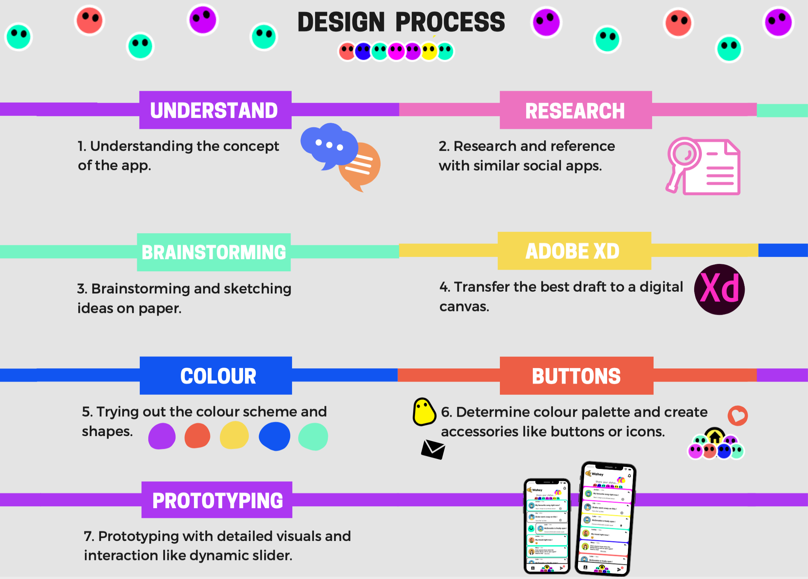
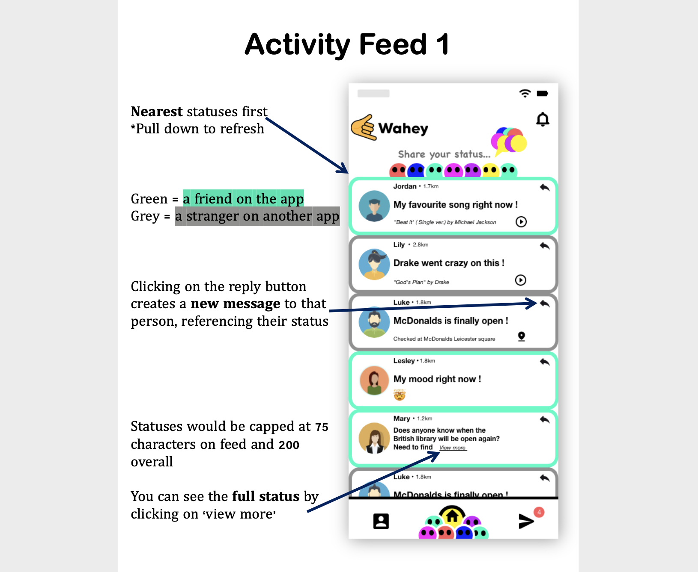
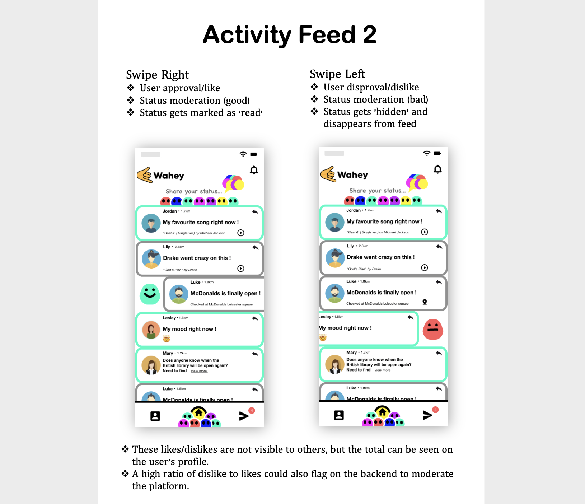
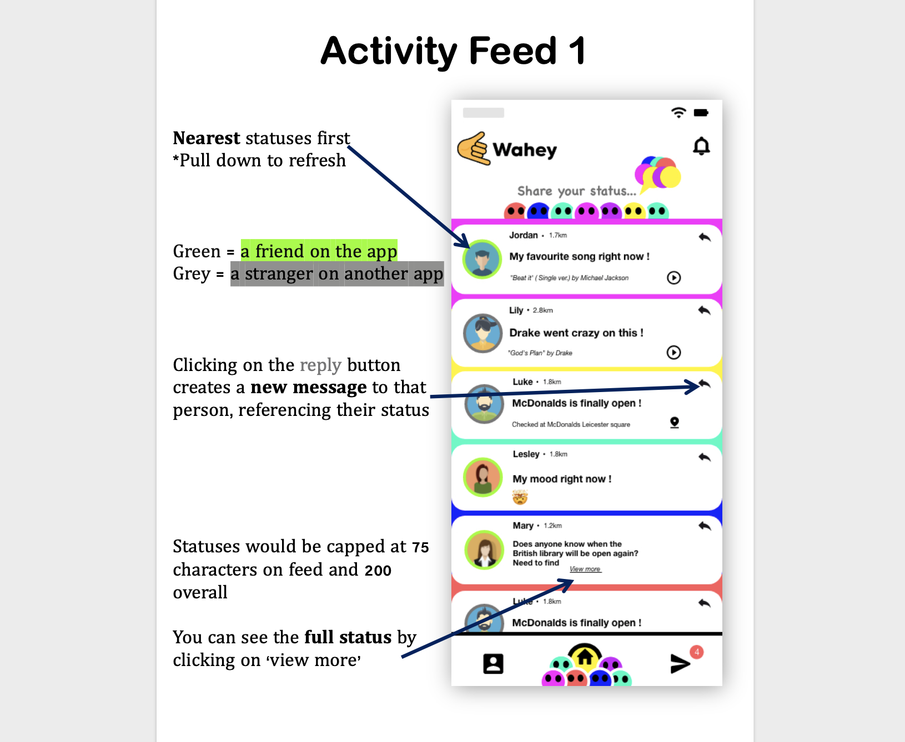
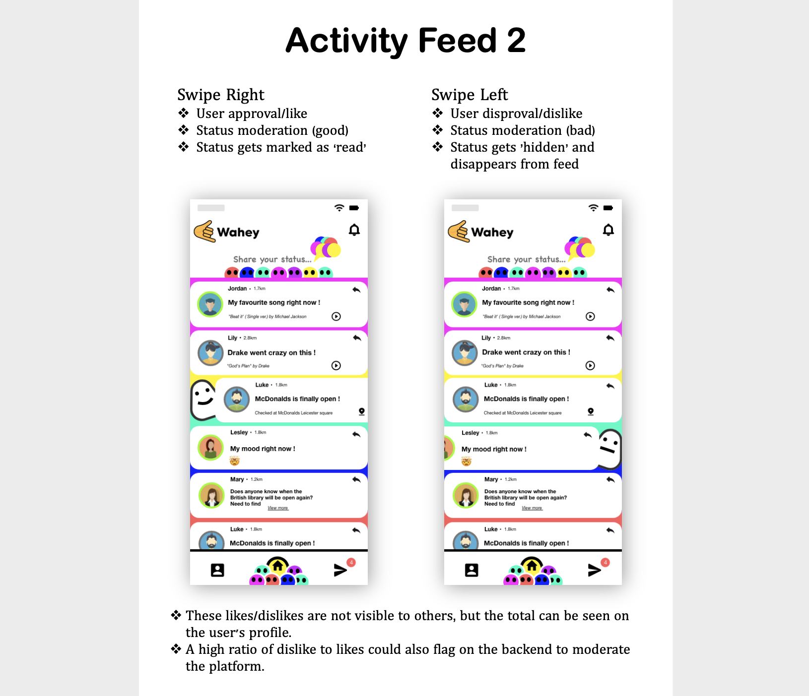
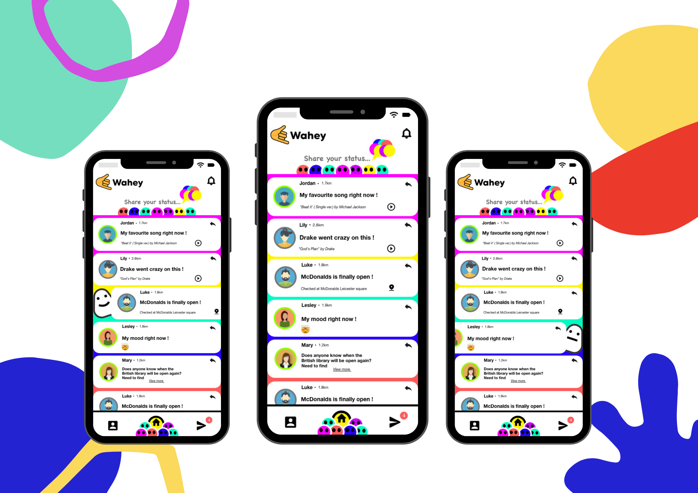

# Designing a Brand New Social Mobile App
Brand: Wahey

Time: 2 days

Setting: IOS

Materials: Paper & Pen, Adobe XD

*******

Wahey is a new social discovery platform. An app for making new friends and starting
conversation with people nearby. Creating a discovery & icebreaker tool for new social possibilities.

 

### Digital Design Process

### Idea of the Elements Design

The idea behind these is that the users are individuals that could be from different backgrounds, colour or gender, but together they form a community.

 

### Prototypes & Explanation
#### Design A

 

#### Design B

