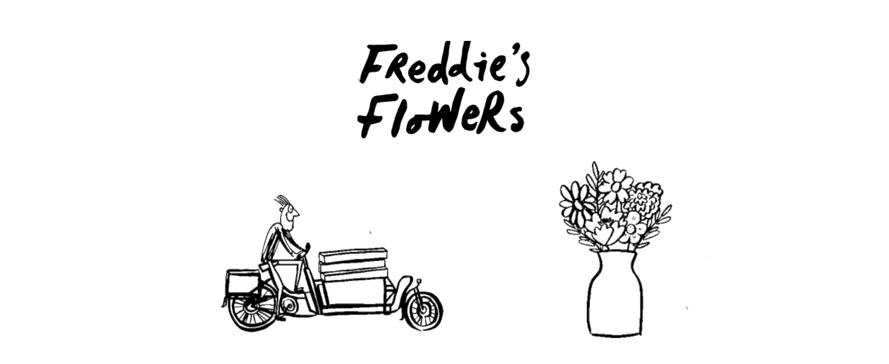
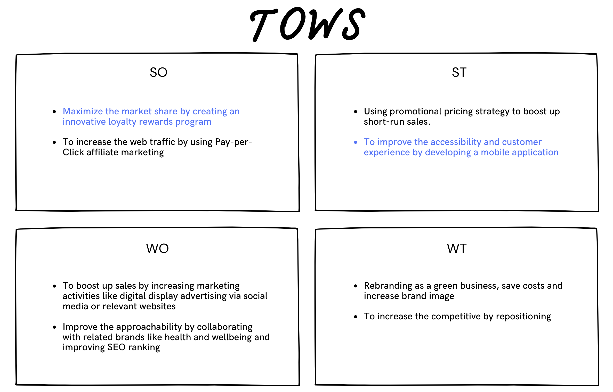
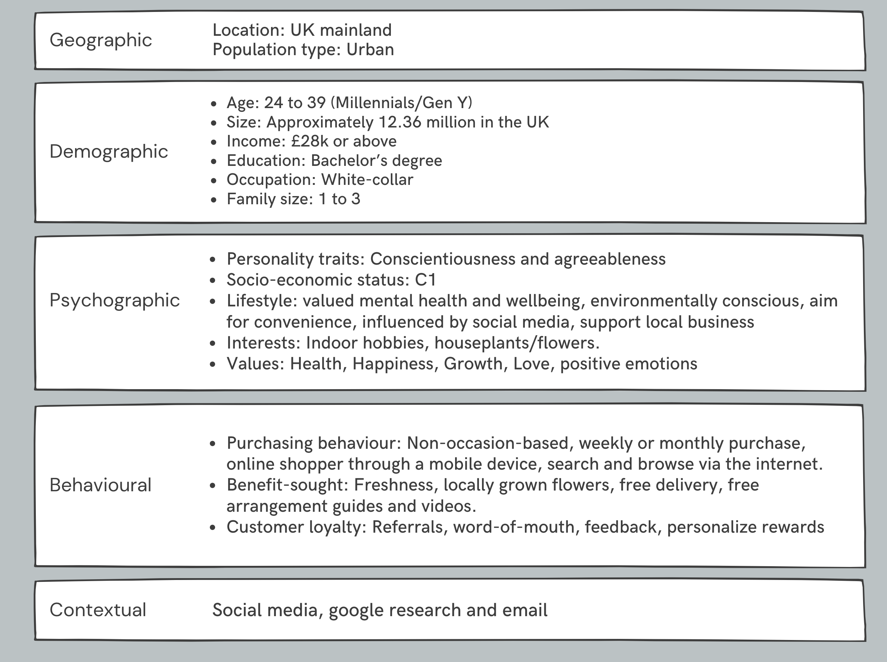
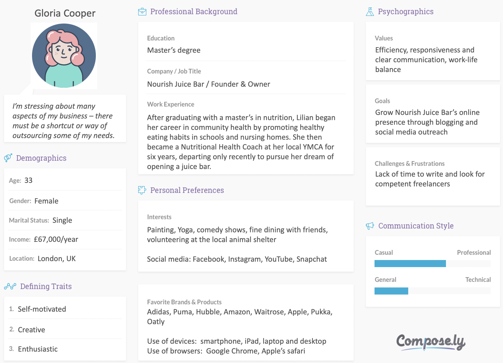
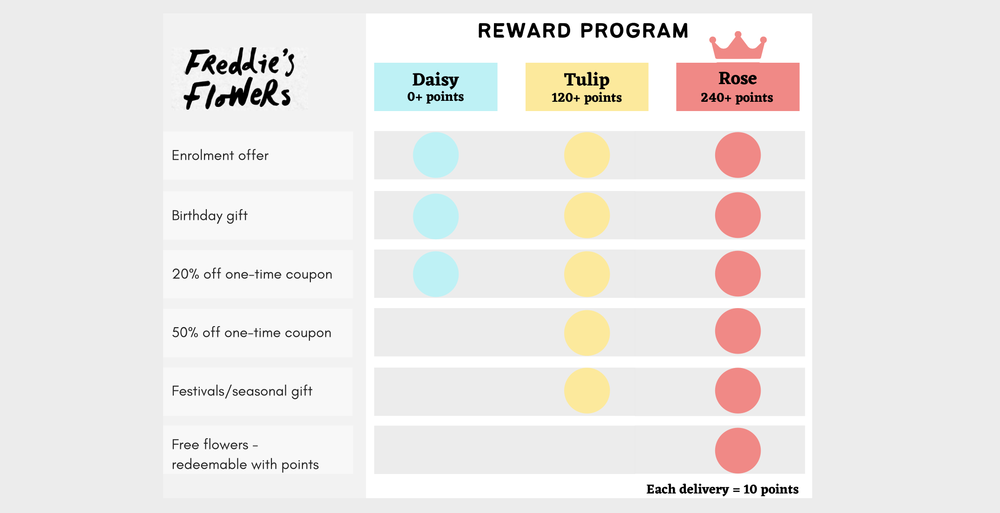
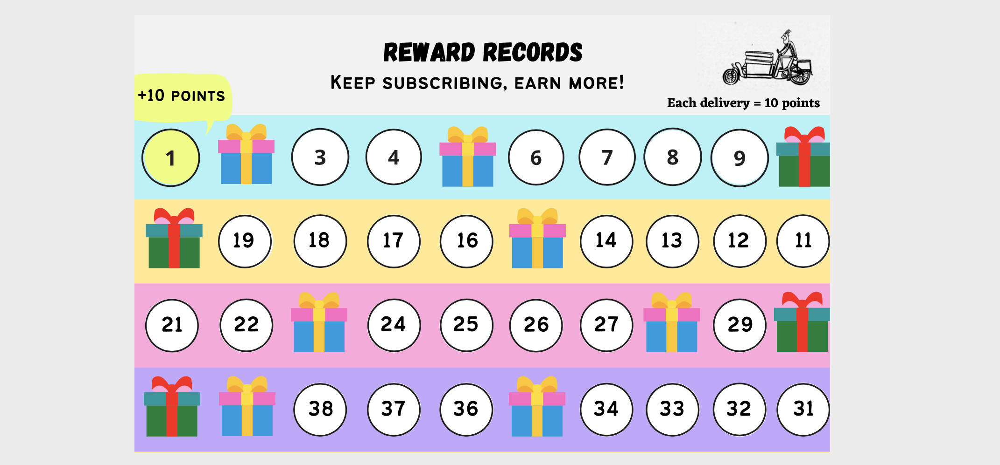
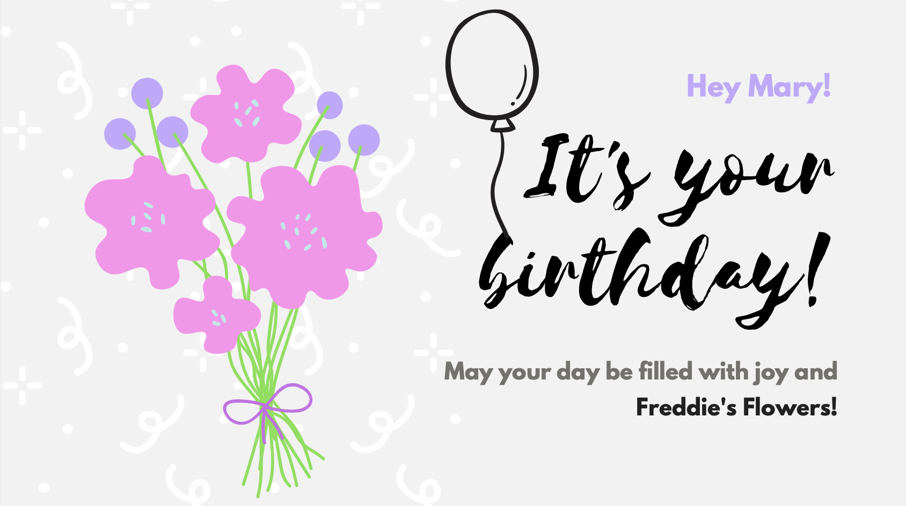
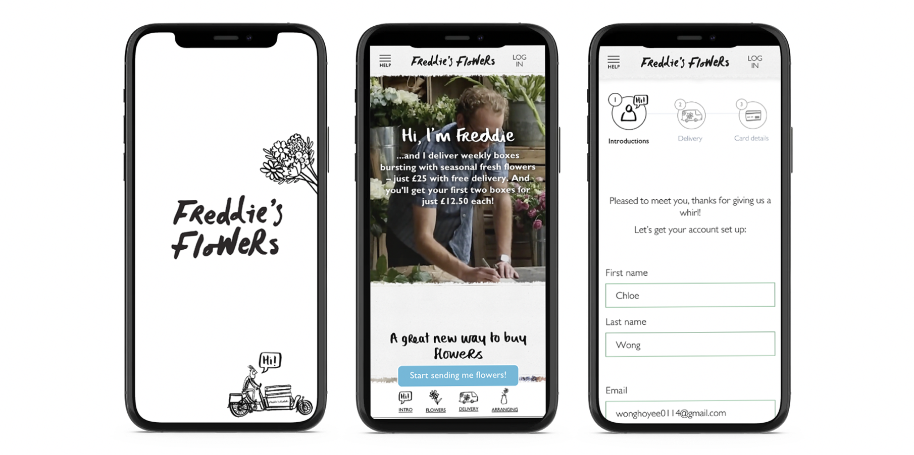
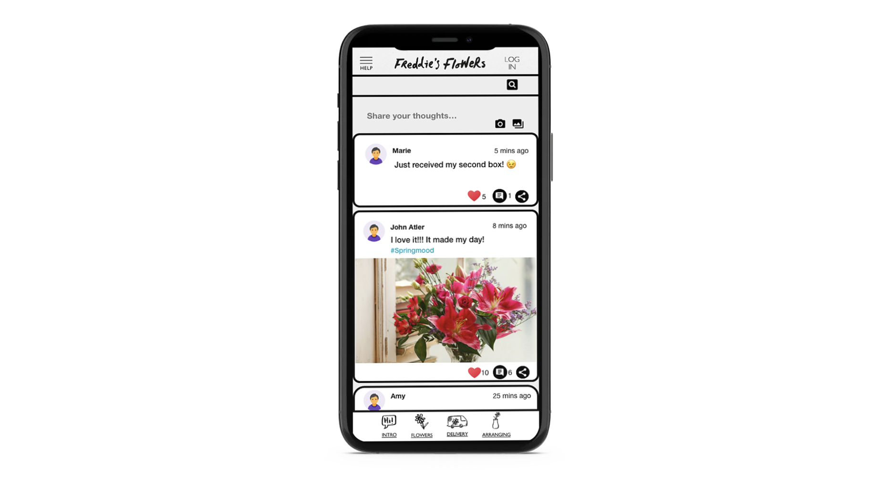
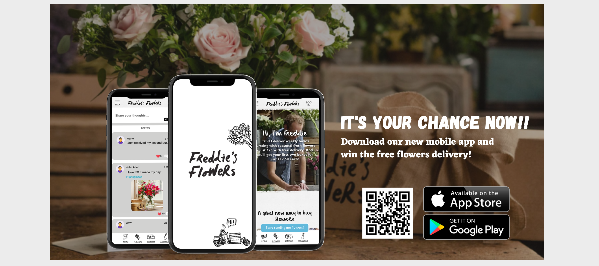

# Digital Audit and Digital Marketing Strategy
Creating a Loyalty Rewarding Mobile Application for a UK Florist Brand - Freddie's Flowers
 
[Full report](https://www.linkedin.com/in/chloehy-wong/)

*******

 
## INTRODUCTION
[Freddie’s Flowers](https://www.freddiesflowers.com/) is a weekly subscription-based flower delivery company which provides free door-to-door delivery service to local customers in the UK. Supplied directly from local growers, it provides the freshest seasonal flowers in a large quantity every week. Besides, each delivery comes with an arrangement guide and flower food that improves customer experience.
 

 
This report will take ‘Freddie's Flowers’ as a study to evaluate and develop a proper digital marketing strategy for a year in order to secure a sustainable competitive advantage within the flower delivery market.

Based on the SOSTAC planning system, the report will begin with analysing internal and external opportunities and challenges by using academic models like SWOTs and PESTLES to develop TOWS strategies. Setting up the objectives by applying the 5S’s method from [Smith and Chaffey](https://www.smartinsights.com/goal-setting-evaluation/goals-kpis/goals-for-your-digital-marketing/). Following by proposing the strategies and recommending a digital marketing plan and tactics. Using a Gantt chart to show the entire project plan that ensures effectiveness and concluding with an evaluation plan.
 

## SUMMARY: SWOT
SWOT analysis is used to gather all the research, considering both positive and negative impact from the external and internal factors, in order to assist in building strategies with the TOWS matrix.

 

## OBJECTIVES - 5S's & SMART
1. Sell: Grow the Annual Recurring Revenue (ARR) by 15% by December of 2021.

2. peak: Increase conversion rate by 30% including online and offline marketing channels.

3. Serve: Achieve 4.7 customer review satisfaction rating by December 2021.

4. Save: Reduce the Customer Acquisition Cost (CAC) by 10% by the end of 2021.

5. Sizzle: Increase returning customer base by 15% by the end of 2021.

 

## STRATEGY
To identify and generate the best strategies for the brand by linking SWOTs external factors to internal factors using the TOWS matrix.

To maximize the profitability and achieve the objectives by gathering two strategies which are developing a mobile application that includes a loyalty rewards program.
 
####  Strategy 1: Maximize the market share by creating innovative loyalty rewards program
The loyalty rewards program is a tier-based program that encourages customers to spend and engage to increase their access to privileges [Black, 2020](https://www.zendesk.com/blog/loyalty-rewards/). Customers gain rewards from every purchase, including from the website. The program can be used to incentivize users to share content on their social media, thus helping with the overall brand marketing strategy.

####  Strategy 2: To improve the accessibility and customer experience by developing a mobile application
The trend of shopping through mobile application is raising rapidly, it makes for a reasonable case to develop a mobile app. The mobile application not only consists of the tiered loyalty program, but also provides primary features like Profile, Subscription, Payment, FAQ, Chatbot, Feedback and more.

Although competitors are growing rapidly as many florists have shifted their business towards online shopping, there is a gap in the market as the majority only sell through a website. Therefore, developing a mobile application with loyalty program and targeting with a distinct segmentation could differentiate the brand from their competitors.

 

## SEGMENTATION
Interestingly, 64% of smartphone users aged 16-24 used mobile apps to purchase online reported by [Mintel’s Trend](https://clients-mintel-com.ucbirmingham.idm.oclc.org/trend/value-2021-priority-shift?fromSearch=%3Ffilters.strategic-topic%3D90%26freetext%3DSubscription%26last_filter%3Dstrategic-topic%26sortBy%3Drecent), which also matches the group of younger generations who gravitate towards buying locally grown flowers [Viberg, 2020](https://reports-mintel-com.ucbirmingham.idm.oclc.org/display/1020477/?fromSearch=%3Ffilters.region%3D10%26freetext%3DOnline%2520flowers%2520%26last_filter%3Dregion). In addition, most of the people aged 16-44 are likely interested in flower subscription services [Viberg, 2020](https://data-mintel-com.ucbirmingham.idm.oclc.org/databook/994486/question/Q20?country=1&d=gender&d=age). With this in mind, younger generation are considered as the target segment with details presented below:

## TARGET MARKET
To visualise and understand the target audience by presenting samples of customer personas.

 

## POSITIONING
Freddie’s Flowers’s positioned in a very competitive place even with a good price-to-value ratio and hence the brand should develop a unique position by developing innovative strategies.

Freddie’s Flowers’ aim is to provide the freshest seasonal flowers from local growers selling with affordable price and delivering straight to the customer’s door. Fulfilling the market gap by developing a mobile application that includes a loyalty rewards program will be the new USP of the brand in order to stand out from the competitors.

 

## TACTICS
### S1: Maximize the market share by creating innovative loyalty rewards program

Tactic 1: A tiered-based design can motivate consumers to continue purchasing and getting rewards which could improve Customer Lifetime Value (CLV). The program consists of 3 tiers, Daisy, Tulip and Rose, each of which grants increasingly more and more benefits to the consumers. Tiers unlock with points collected from every delivery, as seen in [P2]. You get 10 points per delivery.

[P1]Details of the tiered-based reward program

[P2]The concept of the tier-based reward system

 

Tactic 2: Gamifying the entire experience on the loyalty program that could lower the churn rate and bring new customers so as to increase the Return on Investment (ROI). For example, using Spin-to-Win modules [P3] as a reward that keep customers engaged and motivate them to achieve higher level of the tier.

[P3]Rewarding customers by spinning the lucky wheel

 

Tactic 3: Offering new user incentives or referring from word-of-mouth channels which could lower CAC and enhance the returning rate as well as reach the objectives 4 & 5. For example, new members could have a lucky spin as a welcoming reward [P4].

[P4]The welcome spin

 

Tactic 4: Providing an emotional connection like a birthday rewards and festival offers to drive a positive brand image and also strengthen the bond with customers which can also accomplish the objective 3. Members will receive a box of flowers and birthday card [P5] as a birthday reward during their birthday week.

[P5]The sample of birthday card

 

### S2: To improve the accessibility and customer experience by developing a mobile application

Tactic 1: Open a new channel which is developing a mobile app for increasing traffic, reviews and search engine ranking. Also, it can improve the accessibility allowing users to purchase seamlessly from the mobile device anytime and anywhere.

 

Tactic 2: With user-friendly interface design includes clear layout [P6], seamless navigation and more for lowering CAC but increases sales so as to achieve the objectives 1, 2 & 4.

[P6]Prototypes of the cover, main page and subscription page

 

Tactic 3: Offering chatbot [P7] and feedback features that allows customers to resolve their quick questions or reach a representative between 6am-3pm during weekdays and hence lead a positive relationship between the brand and customers.

[P7] Prototype of the chatbot

 

Tactic 4: Providing a social feed [P8] could allow customers share their thoughts and communicate with others to build up a community that could increase customer loyalty.

[P8] Prototype of Social feed

 

### S1 & S2: Tactics for both strategies

Tactic 5: Prepare marketing materials including digital and physical, such as landing page of the new app, previews video and leaflets.

 

Tactic 6: Create the content calendar and prepare the posts for the new launching campaign on social media platforms, like Facebook and Instagram.

 

Tactic 7: Update the official website by adding links to the landing page of the new app. New / existing customers could be available to check the app details and install the app by clicking the links or scanning a QR code.

[P9]Example of the banner for the landing page

 

Tactic 8: In the promotion phase, sending newsletter via email to announce the new mobile app has launched to existing customers and remind users to update the mobile app when the loyalty program release. Regular customers could get extra rewards by scanning the QR code displayed on the delivery box and also on leaflets including the highlight of the new app with referral codes to their friends and family.

Tactic 9: Advertise on social media and Google Ads

## ACTIONS

## CONTROL  

## CONCLUSION
After evaluating the one-year marketing strategy plan using the SOSTAC model it shows positive impacts by developing new strategies and tactics that benefit Freddie’s Flowers. Hence the mobile application includes an innovative loyalty rewards program.

The analysis on competitors and market trends identified market gaps and pain-points, such as the lack of alternative channels, besides their own website and social media, for accessing brands in the online flowers market. Furthermore, younger generations are changing their buying behaviours into online and increasingly moving into purchases via mobile applications. Therefore, to meet this demand, new strategies should be introduced for the benefit of customers and Freddie’s Flowers.

To ensure smooth launching of the new strategies, the marketing, development and design team should coordinate and work closely while staying in communication with stakeholders and users alike to achieve the objectives and customer experience.

The objectives are mainly focused on the sales using statistics measurement and improving customer satisfaction which are set within a 12-month timeframe. Development of these strategies and tactics is tracked by following a plan presented as a Gantt chart and establishing a control plan to estimate the effectiveness of the project.
