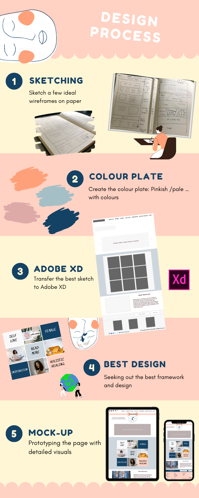
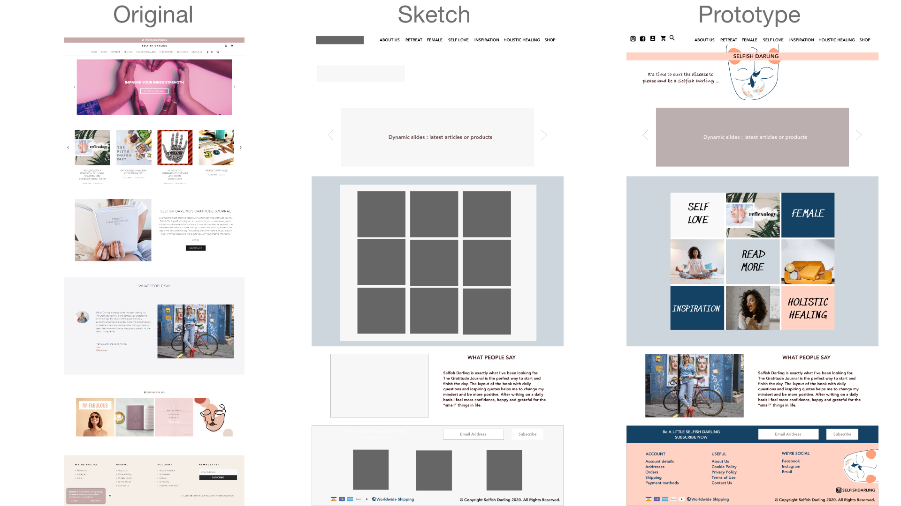

# Redesigning A Fem-site Landing Page

Brand: Selfish Darling

Time: 1 day

Setting: WordPress site

Materials: Paper & Pen, Adobe XD

Techniques: Business Analysis, Sketching, Wireframing & Prototyping

# Analysing Pain-points & Solution:

Pain-points:
1.	Too many sub-pages and sections with similar topics that make the user lose attention.
2.	Unpolished menus and utilisation of the space available.
3.	Too many dynamic slides on the top that make the page a bit messy.
4.	Unclear brand value.

Solution:
1.	Organised and grouped sections together into a single space that attracts user attention.
2.	Moved the menus to the top with other icons aligned.
3.	Removed one of the dynamic slides and left the latest news slide on the top.
4.	Redesigned the heading quote with a new theme and elements that show the brand value.

