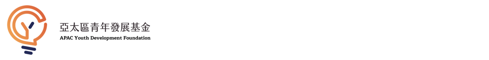
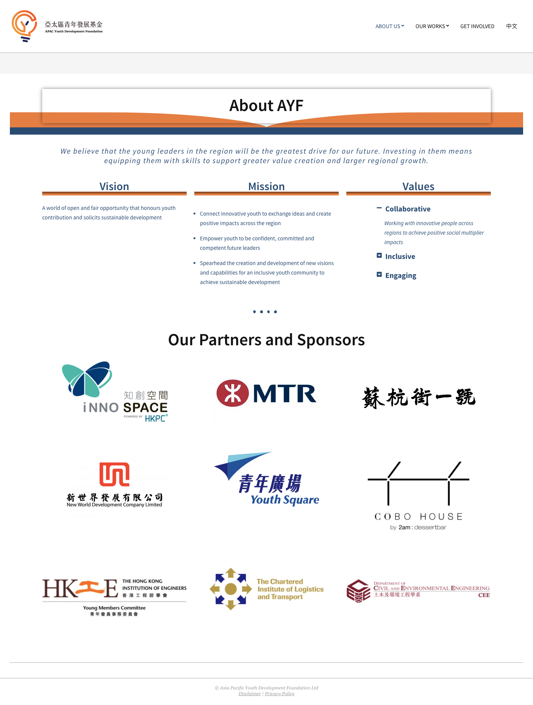
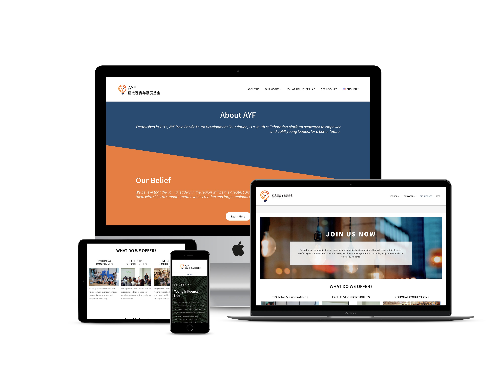
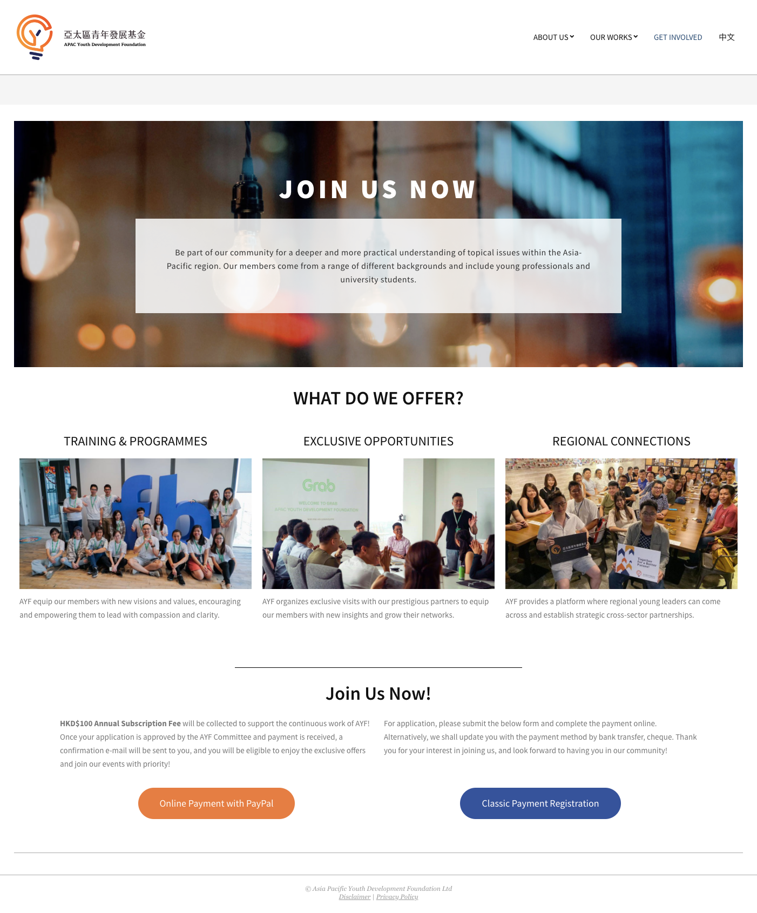

## Redesigning a WordPress Site
Organisation: Asia Pacific Youth Development Foundation

Time: 1 month

Setting: WordPress environment with CMS system.

Layout guideline: Compelling, Modern and Clear.

******

### Redesigning a WordPress Site

The Asia Pacific Youth Development Foundation (AYF), established in 2017, is a youth collaboration platform dedicated to empowering and uplift young leaders for a better future. They believe that the young leaders in the region will be the best drive for our future as their vision is “A world of open and fair opportunity that honours youth contribution and solicits sustainable development.”

 

### Objectives of the project
1.	To migrate the existing website for a clearer branding.
2.	Showing professional brand image so as to build up creditability.
3.	Engaging more potential partners/ members from the website.

 

### My responsibility

#### Static design: Home page & About us
 

**Home page**

 

**About us**  

 

#### Responsive design
The site will be adopted to any screen size, includes iPhone X, iPad and more.

 

#### Call-to-action input
**Get Involved**

