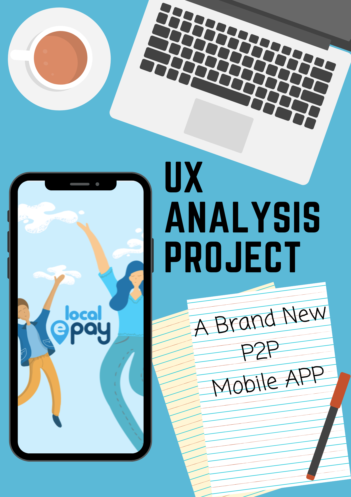

# A UX Analysis Project
Brand: Local E

Time: 2 days

Setting: IOS

Materials: Paper & Pen, Zeplin

*****

Local E was created with a mission to help the best local independent restaurants and takeaways stand out and compete in a world of high street mega chains and online corporate giants, whilst digitally rewarding you along the way for your loyalty.

## The project
Developing a new mobile app that includes a rewarding P2P payment system for locals and independents.

## My responsibility: 	
* Analysing and Evaluating the prototyping of UX effectiveness.  
*	Considering interaction models, user task flows, and UI specifications.
*	Defining the problem and suggesting alternative solutions.

 

All the details are protected by NDA, waiting for the app launch to reveal.

